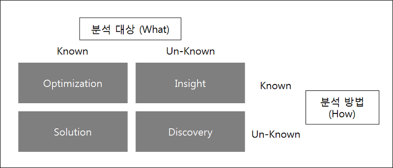

|                   |              | [분석 방법을 안다]   |           |                     |
| ----------------- | ------------ | -------------------- | --------- | ------------------- |
|                   | Optimization |                      | Insight   |                     |
| [분석대상을 안다] |              |                      |           | [분석대상을 모른다] |
|                   | Solution     |                      | Discovery |                     |
|                   |              | [분석 방법을 모른다] |           |                     |

### 분석 대상을 알면 OS

Optimization : 분석 대상 및 분석 방법을 이해하고, 현 문제를 최적화

Solution : 분석 대상을 알고, 분석 방법을 모른다.

### 분석 대상을 모르면 ID

Insight : 분석대상을 모르고, 분석 방법을 알고 있음

Discovery : 분석 대상을 모르고 분석방법도 모른다.
