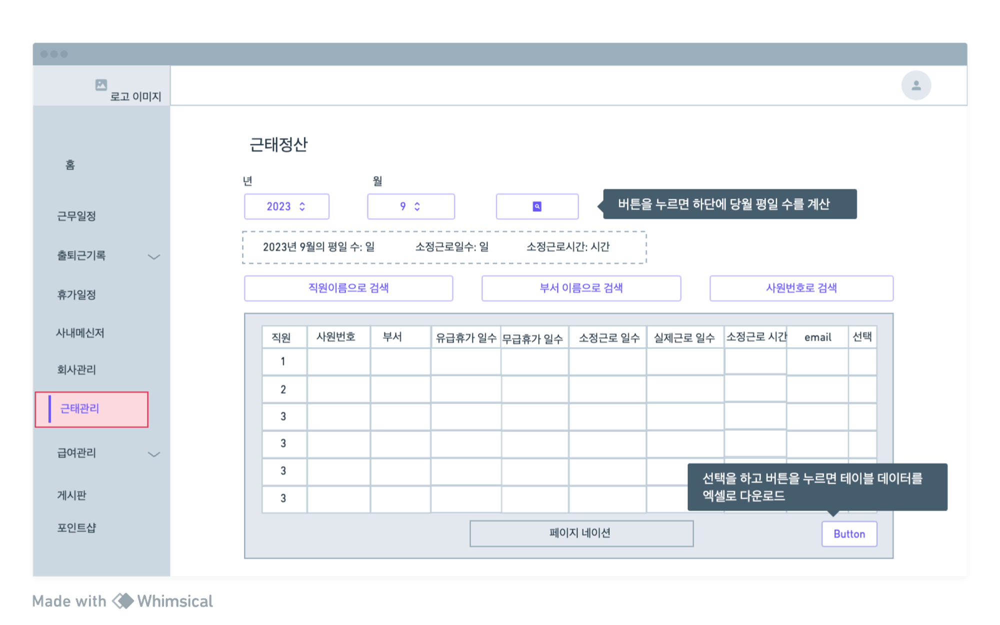
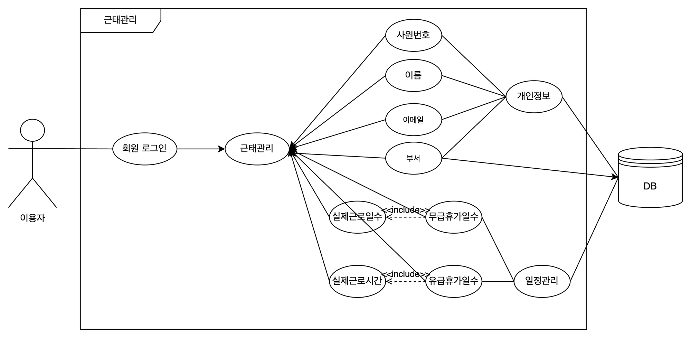
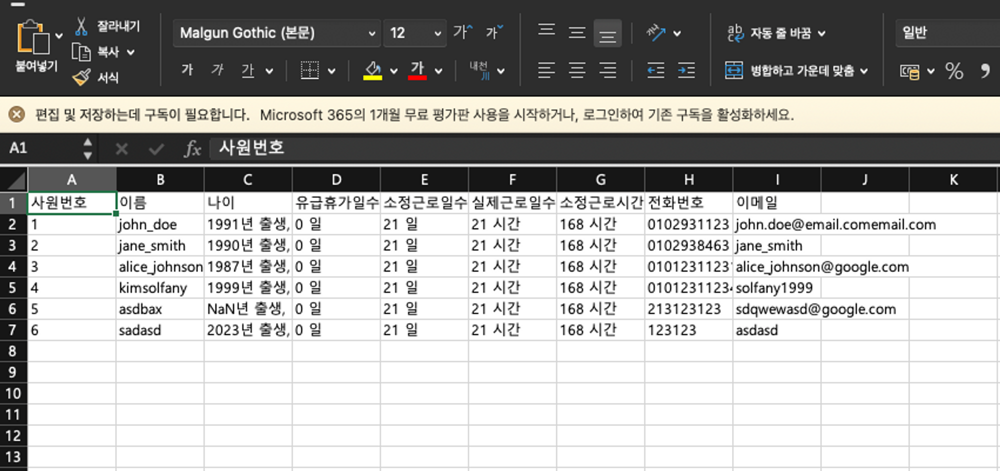
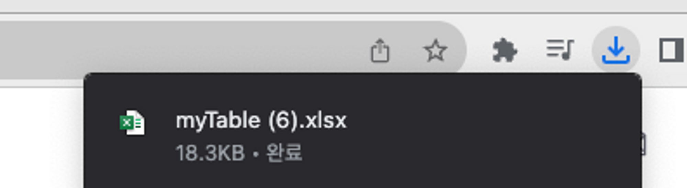

# 근태 관리 페이지


# 와이어프레임



# 유스케이스



# Front-end

<aside>
📍 이 코드는 React로 작성된 컴포넌트인 **`TimeManagementSystem`** 컴포넌트에 대한 코드이다. 해당  컴포넌트는 근태 관리 시스템을 표시하고 관리하는 데 사용된다.

이 컴포넌트에서 제공하는 주요 기능을 간략하게 요약하면 다음과 같다. 👇🏻

### 1. 데이터 가져오기와 표시:

- **`useEffect`**를 사용하여 컴포넌트가 처음 렌더링될 때 및 특정 상태(state)가 변경될 때 서버에서 근태 관리 데이터를 비동기적으로 가져온다. 이 데이터는 **`users`** 상태에 저장된다.
- 가져온 데이터를 테이블 형태로 화면에 표시한다.
  이때, 페이징 기능을 사용하여 한 페이지에 일정한 개수의 항목을 표시하고 페이지를 전환할 수 있도록 한다.

### 2. 검색 및 정렬:

- 사용자는 직원 이름, 부서 이름, 사원 번호로 데이터를 검색할 수 있다. 검색어가 입력될 때마다 해당 검색어와 일치하는 데이터만 표시된다.
- 사용자는 각 열의 헤더를 클릭하여 정렬할 수 있다. 열 헤더 클릭 시 해당 열을 오름차순 및 내림차순으로 정렬할 수 있다.

### 3. 엑셀 다운로드 및 체크박스 선택:

- 사용자는 테이블 상의 체크박스를 선택하여 특정 항목을 선택할 수 있다.
- 선택된 항목에 대한 엑셀 다운로드 버튼을 제공하며, 선택된 항목에 대한 엑셀 파일을 다운로드할 수 있다.
- 엑셀 다운로드 버튼을 누를 때 선택된 항목의 데이터를 엑셀 양식에 맞게 가공하고 다운로드한다.

**_이렇게 크게 세 가지 부분으로 나누어진 기능을 가지고 있는 `TimeManagementSystem` 컴포넌트는
근태 관리 시스템의 데이터 조회, 검색, 정렬, 엑셀 다운로드, 항목 선택 등 다양한 기능을 제공한다_.**

</aside>

## 1. 서버에서 데이터 받아오기

---

```jsx
// 서버에서 데이터 불러오기
useEffect(() => {
  // fetch("/api/timeManagement")를 사용하여 데이터를 불러옵니다.
  fetch("/api/timeManagement")
    .then((response) => response.json())
    .then((data) => {
      // 데이터를 받아와서 setUsers 함수를 사용하여 users 상태를 업데이트합니다.
      setUsers(data);
      console.log(data);
    });
}, []); // 빈 배열을 두 번째 인자로 전달하여 한 번만 실행되도록 설정합니다.
```

> React에서 사용되는 **`useEffect`** 훅을 활용하여 데이터를 가져오고 가공한다.
>
> 1. **`useEffect`** 훅을 사용하여 컴포넌트가 처음 렌더링될 때 한 번만 실행되도록 설정한다.
> 2. **`fetch`** 함수를 사용하여 서버의 **`/api/timeManagement`** 엔드포인트로 HTTP GET 요청을 보낸다 → 해당 요청은 서버에서 근태 관리 데이터를 가져오는 요청이다.
> 3. 서버에서 응답을 받으면 **`.then`** 메서드를 사용하여 JSON 형식으로 파싱하고,
>    파싱된 데이터를 **`setUsers`** 함수를 통해 **`users`** 상태에 업데이트한다.
> 4. **`console.log(data)`**를 사용하여 데이터가 성공적으로 로드되었는지 콘솔에 기록한다.

## 2. TimeManagementSystem 기능 설명

### 2-1. 페이징 기능

1. **useState를 이용한 상태 관리**:

   ```jsx
   const [currentPage, setCurrentPage] = useState(1);
   ```

   - **`currentPage`**: 현재 페이지 번호를 나타내는 상태 변수이다. 기본값으로 1을 설정한다.

2. **itemsPerPage 상수 정의**:

   ```jsx
   const itemsPerPage = 10;
   ```

   - **`itemsPerPage`**: 한 페이지에 표시할 아이템 수를 나타내는 상수이다.
     10개의 항목이 한 페이지에 표시되도록 설정해주었다.

3. **handlePageChange 이벤트 핸들러**:

   ```jsx
   const handlePageChange = (page) => {
     setCurrentPage(page);
   };
   ```

   - **`handlePageChange`** 함수는 페이지 변경을 처리하는 이벤트 핸들러이다.
   - 사용자가 페이지 번호를 클릭하면 해당 페이지 번호가 **`setCurrentPage`** 함수를 통해 **`currentPage`** 상태로 설정된다.

4. **totalPages 계산**:

   ```jsx
   const totalPages = Math.ceil(users.length / itemsPerPage);
   ```

   - **`totalPages`**: 전체 페이지 수를 계산한다.
     이를 위해 전체 데이터의 길이(**`users.length`**)를 한 페이지에 표시될 아이템 수(**`itemsPerPage`**)로 나누고 올림 함수(**`Math.ceil`**)를 사용하여 계산한다.

5. **getCurrentItems 함수**:

   ```jsx
   const getCurrentItems = () => {
     return getFilteredAndSortedItems().slice(
       (currentPage - 1) * itemsPerPage,
       currentPage * itemsPerPage
     );
   };
   ```

   - **`getCurrentItems`** 함수는 현재 페이지에 표시할 아이템을 반환한다.
   - **`getFilteredAndSortedItems`** 함수로부터 필터링 및 정렬된 데이터를 가져온 후,
     현재 페이지에 해당하는 아이템 범위를 **`slice`** 메서드를 사용하여 추출하게 된다.

6. **Pagination 컴포넌트 렌더링**:

   ```jsx
   <Pagination
     current={currentPage}
     total={users.length}
     pageSize={itemsPerPage}
     onChange={handlePageChange}
   />
   ```

   - 위의 코드는 Ant Design의 **`Pagination`** 라이브러리를 사용하여 컴포넌트로 분리해둔 페이지네이션 컴포넌트를 렌더링한다.
   - **`current`** prop은 현재 페이지 번호를 나타내며, **`total`** prop은 전체 아이템 수를 나타낸다.
   - **`pageSize`** prop은 한 페이지에 표시할 아이템 수를 설정한다.
   - **`onChange`** prop은 페이지 번호가 변경될 때 실행할 콜백 함수로, **`handlePageChange`** 함수가 할당된다.

---

### 2-2. 엑셀 컬럼 지정

```jsx
// 엑셀 양식
const tableColumns = [
  "사원번호",
  "이름",
  "나이",
  "유급휴가일수",
  "소정근로일수",
  "실제근로일수",
  "소정근로시간",
  "전화번호",
  "이메일",
];
```

> **`tableColumns`** 배열은 엑셀 출력 양식의 컬럼 이름을 포함한다.

### 2-3 . 생년월일을 현재 나이로 변환

```jsx
javascriptCopy code
// 나이 및 출생년도를 반환하는 함수
function getAgeAndBirthYear(birthDate) {
  // 년도만 추출
  const birthYear = parseInt(birthDate.split("-")[0], 10);
  const currentYear = new Date().getFullYear();
  const age = currentYear - birthYear; // 현재 나이 계산

  return `${birthYear}년 출생, 나이 만 ${age}세`;
}

```

> **`getAgeAndBirthYear`** 함수는 사원의 출생일을 받아서 나이와 출생년도를 계산하고 해당 정보를 문자열로 반환한다.
> 해당 코드는 엑셀기능과 서비스 사용자에게 보기 좋게 서비스를 제공하기 위해 고안되었다!

### 2-4. 엑셀 필드에 들어갈 값

```jsx
// 엑셀 데이터 설정과 가공
useEffect(() => {
  setTableData(
    users.map((user) => [
      `${user.staff.empNum}`, // 사원 번호
      `${user.staff.empName}`, // 사원 이름
      `${getAgeAndBirthYear(user.birthDate)}`, // 연도를 나이로 변환하는 함수
      `${user.vacation} 일`, // 유급휴가일수
      `${user.workingDays} 일`, //소정근로일수
      `${user.actualWorkDays} 시간`, // 실제근로일수
      `${user.workingHours} 시간`, //소정근로시간
      `${user.phoneNumber} `, // 핸드폰
      `${user.staff.email} `, //이메일
    ])
  );
}, [users]);
```

> **`useEffect`**는 서버에서 받아온 **`users`** 데이터를 기반으로 엑셀 출력을 위한 데이터를 가공하고, **`tableData`** 상태를 업데이트한다.

### 2-5. 오름차순, 내림차순에 대한 정렬과 페이징

```jsx
// 현재페이지 반환
const getFilteredAndSortedItems = () => {
  let filteredUsers = users.filter((user) => {
    const nameMatch = user.staff.empName
      .toLowerCase()
      .includes(searchName.toLowerCase());
    const deptMatch = user.staff.dept
      .toLowerCase()
      .includes(searchDepartment.toLowerCase());
    const empNumMatch = String(user.staff.empNum).includes(searchEmpNum);

    return nameMatch && deptMatch && empNumMatch;
  });

  // 정렬 로직
  if (currentSortKey === "empName") {
    filteredUsers.sort((a, b) =>
      sortDirection === "asc"
        ? a.staff.empName.localeCompare(b.staff.empName)
        : b.staff.empName.localeCompare(a.staff.empName)
    );
  } else if (currentSortKey === "vacation") {
    filteredUsers.sort((a, b) =>
      sortDirection === "asc"
        ? a.vacation - b.vacation
        : b.vacation - a.vacation
    );
  }
  return filteredUsers;
};
```

> **`getFilteredAndSortedItems`** 함수는 검색어와 정렬 상태를 고려하여 데이터를 필터링하고 정렬한다.

### 2-6. 테이블 정렬

```jsx
// 정렬
const sortByKey = (a, b, key, direction) => {
  if (a[key] === b[key]) return 0;
  const order = a[key] > b[key] ? 1 : -1;
  return direction === "asc" ? order : -order;
};

const handleSortBy = (key) => {
  const newDirection = sortDirection === "asc" ? "desc" : "asc";
  setCurrentSortKey(key);
  setSortDirection(newDirection);
};
```

> **`sortByKey`** 함수는 주어진 키 및 방향으로 객체 배열을 정렬하고, **`handleSortBy`** 함수는 컬럼 이름을 클릭하여 테이블을 정렬하는 데 사용된다. 정렬을 바탕으로 현재 정렬 키와 방향을 업데이트한다.

### 2-7. 체크박스 선택

```jsx
// 체크박스 선택
const handleCheckbox = (index) => {
  setCheckedIndex(checkedIndex === index ? -1 : index);
};
```

> **`handleCheckbox`** 함수는 각 행의 체크박스를 선택 또는 해제한다. 선택한 항목의 인덱스를 관리하는 기능이다.

### 2-9. 검색 기능

```jsx
// 검색창 이벤트 핸들러
const handleSearchNameChange = (event) => {
  setSearchName(event.target.value);
  setCurrentPage(1);
};

const handleSearchDepartmentChange = (event) => {
  setSearchDepartment(event.target.value);
  setCurrentPage(1);
};

const handleSearchEmpNumChange = (event) => {
  setSearchEmpNum(event.target.value);
  setCurrentPage(1);
};
```

> 이러한 함수들은 검색 창에서 이름, 부서, 또는 사원 번호를 입력하면 해당 기준으로 데이터를 필터링한다.  
> 검색어를 입력하고 검색 버튼을 클릭하면 데이터가 실시간으로 필터링된다.

```jsx
<Row>
  <Col md="4">
    <Input
      type="text"
      value={searchName}
      onChange={handleSearchNameChange}
      placeholder=" 직원 이름으로 검색"
      onClick={() => setCheckedIndex(-1)}
    />
  </Col>
  <Col md="4">
    <Input
      type="text"
      value={searchDepartment}
      onChange={handleSearchDepartmentChange}
      placeholder=" 부서 이름으로 검색"
      onClick={() => setCheckedIndex(-1)}
    />
  </Col>
  <Col md="4">
    <Input
      type="text"
      value={searchEmpNum}
      onChange={handleSearchEmpNumChange}
      placeholder=" 사원번호로 검색"
      onClick={() => setCheckedIndex(-1)}
    />
  </Col>
</Row>
```

검색창 사용 모습 이다!

## 3. tableToExcel 기능

<aside>
💡 사용자가 선택한 테이블의 행 데이터를 엑셀 파일로 내려받는 기능을 구현한 **`TableToExcel`** 컴포넌트이다. 
이 컴포넌트는 엑셀 다운로드 버튼을 렌더링하고, 해당 버튼을 클릭하면 선택한 데이터를 엑셀 파일로 내보내는 역할을 한다.

</aside>

```java
import React from "react";
import * as XLSX from "xlsx";
import { Button } from "reactstrap";

/**
 * TableToExcel 컴포넌트는 사용자가 선택한 테이블의 행 데이터를 엑셀 파일로 내려받기 위한 기능을 제공합니다.
 */
const TableToExcel = ({
  tableData, // 전체 테이블 데이터
  tableColumns, // 테이블의 컬럼 목록
  fileName, // 저장할 엑셀 파일의 이름
  sheetName, // 엑셀 시트의 이름
  checkedIndex, // 사용자가 선택한 테이블의 행 인덱스
}) => {
  /**
   * 사용자가 선택한 행 데이터를 엑셀 파일로 내려받는 기능을 수행합니다.
   */
  const exportToExcel = () => {
    // 사용자가 선택한 행 데이터를 추출
    const checkedData = extractCheckedData(tableData, checkedIndex);

    // 엑셀 파일에 추가될 데이터 목록을 구성
    // 이 목록에는 제목, 컬럼 이름, 사용자가 선택한 행 데이터가 포함된다.
    const sheetData = [["근태정산"], tableColumns, ...checkedData];

    // 데이터 목록을 바탕으로 엑셀 시트를 생성
    const ws = XLSX.utils.aoa_to_sheet(sheetData);

    // 새로운 엑셀 워크북을 생성하고, 앞서 생성한 시트를 추가
    const wb = XLSX.utils.book_new();
    XLSX.utils.book_append_sheet(wb, ws, sheetName);

    // 워크북을 엑셀 파일로 저장
    XLSX.writeFile(wb, `${fileName}_근태정산.xlsx`);
  };

  // "내려받기" 버튼. 버튼을 클릭하면 exportToExcel 함수가 실행다.
  return (
    <Button size="sm" onClick={exportToExcel}>
      내려받기
    </Button>
  );
};

/**
 * 사용자가 선택한 행 데이터를 추출.
 */
const extractCheckedData = (tableData, checkedIndex) => {
  return tableData.filter((rowData, rowIndex) => rowIndex === checkedIndex);
};

export default TableToExcel;
```

### 3-1. 주요 기능은 다음과 같다:

1. **`exportToExcel` 함수**: 이 함수는 엑셀 파일로 데이터를 내보내는 핵심 역할을 한다. 아래와 같이 동작한다.

   > - **`extractCheckedData`** 함수를 사용하여 사용자가 선택한 행 데이터를 추출한다.
   >
   > - 데이터 구성: 엑셀 파일에 추가될 데이터 목록을 구성한다. 이 목록에는 제목, 컬럼 이름, 사용자가 선택한 행 데이터가 포함된다.
   > - 시트 생성: 데이터 목록을 바탕으로 엑셀 시트를 생성한다.
   > - 워크북 생성: 새로운 엑셀 워크북을 생성하고, 앞서 생성한 시트를 추가한다.
   >
   > - 파일 저장: 워크북을 엑셀 파일로 저장한다.

2. **"내려받기" 버튼**: 화면에 내려받기 버튼을 렌더링한다.

   > 이 버튼을 클릭하면 **`exportToExcel`** 함수가 실행되어 사용자가 선택한 데이터를 엑셀 파일로 내보낸다.

3. **`extractCheckedData` 함수**: 이 함수는 사용자가 선택한 행 데이터를 추출한다. **`tableData`** 배열에서 **`checkedIndex`**에 해당하는 행 데이터를 필터링하여 반환한다.

   > 이 컴포넌트는 엑셀 파일 내려받기 기능을 구현하여 데이터를 사용자가 손쉽게 내보낼 수 있도록 도와준다.
   > 이로써 사용자는 테이블에서 선택한 데이터를 엑셀 파일로 저장하고 공유하는 데 편리하게 이용할 수 있도록 설계했다!

## 4. XLSX 라이브러리 사용 방법

이 코드는 React를 사용하여 테이블 데이터를 엑셀 파일로 내보내는 기능을 구현한 **`TableToExcel`** 컴포넌트이다.





### 4-1. **XLSX 라이브러리와 필수 요소 가져오기**:

```jsx
import React from "react";
import * as XLSX from "xlsx";
import { Button } from "reactstrap";
```

- **`XLSX`**: 엑셀 파일을 생성하고 조작하기 위한 라이브러리로, **`xlsx`** 모듈을 가져옵니다.
- **`Button`**: Reactstrap 라이브러리에서 제공하는 버튼 컴포넌트를 가져옵니다.

1. **`TableToExcel` 함수형 컴포넌트 정의**:

   ```jsx
   const TableToExcel = ({
     tableData, // 전체 테이블 데이터
     tableColumns, // 테이블의 컬럼 목록
     fileName, // 저장할 엑셀 파일의 이름
     sheetName, // 엑셀 시트의 이름
     checkedIndex, // 사용자가 선택한 테이블의 행 인덱스
   }) => {
   ```

   - **`TableToExcel`** 컴포넌트는 다음과 같은 속성을 받아옵니다:
     - **`tableData`**: 전체 테이블 데이터.
     - **`tableColumns`**: 테이블의 컬럼 목록.
     - **`fileName`**: 저장할 엑셀 파일의 이름.
     - **`sheetName`**: 엑셀 시트의 이름.
     - **`checkedIndex`**: 사용자가 선택한 테이블의 행 인덱스.

### 4-2. **exportToExcel 함수 정의**:

```jsx
const exportToExcel = () => {
  // 사용자가 선택한 행 데이터를 추출
  const checkedData = extractCheckedData(tableData, checkedIndex);

  // 엑셀 파일에 추가될 데이터 목록을 구성
  const sheetData = [["근태정산"], tableColumns, ...checkedData];

  // 데이터 목록을 바탕으로 엑셀 시트를 생성
  const ws = XLSX.utils.aoa_to_sheet(sheetData);

  // 새로운 엑셀 워크북을 생성하고, 앞서 생성한 시트를 추가
  const wb = XLSX.utils.book_new();
  XLSX.utils.book_append_sheet(wb, ws, sheetName);

  // 워크북을 엑셀 파일로 저장
  XLSX.writeFile(wb, `${fileName}_근태정산.xlsx`);
};
```

- **`exportToExcel`** 함수는 내보내기 버튼이 클릭되면 실행된다.
- 사용자가 선택한 행 데이터를 추출하고, 이 데이터를 엑셀 파일로 저장하기 위한 단계를 수행다.

### 4-3. **"내려받기" 버튼 렌더링**:

```jsx
return (
  <Button size="sm" onClick={exportToExcel}>
    내려받기
  </Button>
);
```

- 화면에 "내려받기" 버튼을 렌더링하고, 이 버튼을 클릭하면 **`exportToExcel`** 함수가 실행다.

1. **`extractCheckedData` 함수 정의**:

   ```jsx
   const extractCheckedData = (tableData, checkedIndex) => {
     return tableData.filter((rowData, rowIndex) => rowIndex === checkedIndex);
   };
   ```

   - **`extractCheckedData`** 함수는 사용자가 선택한 행 데이터를 추출하는 함수이다.
   - **`tableData`** 배열에서 **`checkedIndex`**에 해당하는 행 데이터를 필터링하여 반환다.

해당 엑셀 컴포넌트는 엑셀 내보내기 기능을 제공하여 사용자가 선택한 데이터를 엑셀 파일로 내보내고 저장할 수 있도록 도와준다.
이것은 웹 애플리케이션에서 데이터를 공유하거나 백업하는 데 유용한 기능이다.

# back-end

- controller

  ```java
  package com.project.backend.controller.timeManagementSystem;

  import com.project.backend.entity.timeManagementSystem.TimeManagementSystem;
  import com.project.backend.service.timemanagement.TimeManagementService;
  import org.springframework.beans.factory.annotation.Autowired;
  import org.springframework.web.bind.annotation.GetMapping;
  import org.springframework.web.bind.annotation.RequestMapping;
  import org.springframework.web.bind.annotation.RestController;

  import java.util.List;

  @RestController
  @RequestMapping("/api")
  public class TimeManagementController {

    private final TimeManagementService timeManagementService;

    @Autowired
    public TimeManagementController(TimeManagementService timeManagementService) {
      this.timeManagementService = timeManagementService;
    }

    // 엔드포인트: 모든 TimeManagementSystem 데이터를 가져옴
    @GetMapping("/timeManagement")
    public List<TimeManagementSystem> getAllTimeManagementData() {
      return timeManagementService.findAll();
    }

    // 추가적인 엔드포인트나 로직은 필요에 따라 추가합니다.
  }
  ```

- Dto

  ```java
  package com.project.backend.dto;

  import lombok.Getter;
  import lombok.Setter;

  import java.util.Date;

  @Getter
  @Setter
  public class TimeManagementDto {
      private Long id;
      private Long empNum;
      private String title;
      private String empName;
      private Date start;
      private Date end;
      private String description;

      public TimeManagementDto() {
          // 기본 생성자
      }
  }
  ```

- entity

  ```java
  package com.project.backend.entity.timeManagementSystem;

  import com.project.backend.entity.Staff;
  import jakarta.persistence.*;

  import java.time.LocalDate;
  import java.time.YearMonth;

  @Entity
  public class TimeManagementSystem {

    @Id
    @GeneratedValue(strategy = GenerationType.IDENTITY)
    private Long id;

    @ManyToOne
    @JoinColumn(name = "staff_id")
    private Staff staff;

    // 유급휴가 일수
    private int vacation;

    // 소정근로일수
    private int workingDays;

    //실제근로일수
    private int actualWorkDays;

    //소정근로시간
    private int workingHours;

    //유급휴가
    private int unpaid;

    //무급휴가
    private int paid;
    private Long empNum;

    private String empId;

    private String dept;

    private String position;

    private String empName;

    private String birthDate;

    private String phoneNumber;

    private String address;

    private String email;

  // 당월의 평일 일수 계산 메서드
  public int calculateWeekdaysInMonth(int year, int month) {
    YearMonth yearMonth = YearMonth.of(year, month);
    LocalDate firstDayOfMonth = yearMonth.atDay(1);
    LocalDate lastDayOfMonth = yearMonth.atEndOfMonth();

    int weekdays = 0;
    LocalDate currentDate = firstDayOfMonth;

    while (!currentDate.isAfter(lastDayOfMonth)) {
      if (currentDate.getDayOfWeek().getValue() >= 1 && currentDate.getDayOfWeek().getValue() <= 5) {
        weekdays++;
      }
      currentDate = currentDate.plusDays(1);
    }

    return weekdays;
  }

    // 당월 평일일수 x 8을 소정근로시간 필드에 설정하는 메서드
    public void updateWorkingHours() {
      int year = YearMonth.now().getYear();
      int month = YearMonth.now().getMonthValue();

      int weekdaysInMonth = calculateWeekdaysInMonth(year, month);
      this.workingHours = weekdaysInMonth * 8;
    }

    // 초기화 메서드에서 값을 계산하여 필드에 설정
    @PrePersist
    @PreUpdate
    public void initializeValues() {
      int year = YearMonth.now().getYear();
      int month = YearMonth.now().getMonthValue();

      int weekdaysInMonth = calculateWeekdaysInMonth(year, month);
      this.workingDays = weekdaysInMonth;
      this.actualWorkDays = weekdaysInMonth; // 기본값으로 설정

      updateWorkingHours(); // 소정근로시간 업데이트
    }

  //  ===============================
    public Long getId() {
      return id;
    }

    public void setId(Long id) {
      this.id = id;
    }

    public Staff getStaff() {
      return staff;
    }

    public void setStaff(Staff staff) {
      this.staff = staff;
    }

    public int getVacation() {
      return vacation;
    }

    public void setVacation(int vacation) {
      this.vacation = vacation;
    }

    public int getWorkingDays() {
      return workingDays;
    }

    public void setWorkingDays(int workingDays) {
      this.workingDays = workingDays;
    }

    public int getActualWorkDays() {
      return actualWorkDays;
    }

    public void setActualWorkDays(int actualWorkDays) {
      this.actualWorkDays = actualWorkDays;
    }

    public int getWorkingHours() {
      return workingHours;
    }

    public void setWorkingHours(int workingHours) {
      this.workingHours = workingHours;
    }

    public Long getEmpNum() {
      return empNum;
    }

    public String getEmpId() {
      return empId;
    }

    public String getDept() {
      return dept;
    }

    public void setDept(String dept) {
      this.dept = dept;
    }

    public String getPosition() {
      return position;
    }

    public String getEmpName() {
      return empName;
    }

    public String getBirthDate() {
      return birthDate;
    }

    public String getPhoneNumber() {
      return phoneNumber;
    }

    public String getAddress() {
      return address;
    }

    public String getEmail() {
      return email;
    }

    public int getUnpaid() {
      return unpaid;
    }

    public void setUnpaid(int unpaid) {
      this.unpaid = unpaid;
    }

    public int getPaid() {
      return paid;
    }

    public void setPaid(int paid) {
      this.paid = paid;
    }

    public void setEmpNum(Long empNum) {
      this.empNum = empNum;
    }

    public void setEmpId(String empId) {
      this.empId = empId;
    }

    public void setPosition(String position) {
      this.position = position;
    }

    public void setEmpName(String empName) {
      this.empName = empName;
    }

    public void setBirthDate(String birthDate) {
      this.birthDate = birthDate;
    }

    public void setPhoneNumber(String phoneNumber) {
      this.phoneNumber = phoneNumber;
    }

    public void setAddress(String address) {
      this.address = address;
    }

    public void setEmail(String email) {
      this.email = email;
    }
  }
  ```

- repository

  ```java
  package com.project.backend.repository;

  import com.project.backend.entity.Staff;
  import com.project.backend.entity.timeManagementSystem.TimeManagementSystem;
  import org.springframework.data.jpa.repository.JpaRepository;
  import org.springframework.stereotype.Repository;

  @Repository
  public interface TimeManagementRepository extends JpaRepository<TimeManagementSystem, Long> {
    // 필요한 추가 쿼리 메서드들을 여기에 정의할 수 있습니다.
    // 예를 들어, 이름으로 TimeManagementSystem 데이터를 찾는 메서드는 아래와 같이 정의할 수 있습니다.
    // List<TimeManagementSystem> findByEmpName(String empName);
    void deleteByStaff(Staff staff);
  }
  ```

- service

  ```java
  package com.project.backend.service.timemanagement;

  import com.project.backend.entity.Staff;
  import com.project.backend.entity.timeManagementSystem.TimeManagementSystem;
  import com.project.backend.repository.StaffRepository;
  import com.project.backend.repository.TimeManagementRepository;
  import org.springframework.beans.factory.annotation.Autowired;
  import org.springframework.stereotype.Service;

  import java.util.List;
  import java.util.Optional;

  @Service
  public class TimeManagementService {

    private final TimeManagementRepository timeManagementRepository;

    @Autowired
    private StaffRepository staffRepository;

    public TimeManagementService(TimeManagementRepository timeManagementRepository) {
      this.timeManagementRepository = timeManagementRepository;
    }

    public void createTimeManagementEntity(Staff staff) {
      TimeManagementSystem timeManagementSystem = new TimeManagementSystem();

      // TimeManagementSystem에 Staff 객체를 연결
      timeManagementSystem.setStaff(staff);

      timeManagementSystem.setEmpNum(staff.getEmpNum());
      timeManagementSystem.setEmpId(staff.getEmpId());
      timeManagementSystem.setPosition(staff.getPosition());
      timeManagementSystem.setEmpName(staff.getEmpName());
      timeManagementSystem.setBirthDate(staff.getBirthDate());
      timeManagementSystem.setPhoneNumber(staff.getPhoneNumber());
      timeManagementSystem.setAddress(staff.getAddress());
      timeManagementSystem.setEmail(staff.getEmail());
      timeManagementSystem.setDept(staff.getDept());

      timeManagementRepository.save(timeManagementSystem);
    }

    public void deleteStaffAndTimeManagementSystem(Long empNum) {
      Staff staff = staffRepository.findById(empNum).orElse(null);
      if (staff != null) {
        timeManagementRepository.deleteByStaff(staff);
        staffRepository.deleteById(empNum);
      }
    }
    public void deleteByStaff(Staff staff) {
      timeManagementRepository.deleteByStaff(staff);
    }

    // 모든 TimeManagementSystem 데이터를 가져옵니다.
    public List<TimeManagementSystem> findAll() {
      return timeManagementRepository.findAll();
    }

    // 특정 ID에 해당하는 TimeManagementSystem 데이터를 가져옵니다.
    public Optional<TimeManagementSystem> findById(Long id) {
      return timeManagementRepository.findById(id);
    }

    // TimeManagementSystem 데이터를 저장합니다.
    public TimeManagementSystem save(TimeManagementSystem timeManagementSystem) {
      return timeManagementRepository.save(timeManagementSystem);
    }

    // 특정 ID의 TimeManagementSystem 데이터를 삭제합니다.
    public void deleteById(Long id) {
      timeManagementRepository.deleteById(id);
    }

  }
  ```

## 기본 근로일 계산 로직

<aside>
📍 그리고 각 코드의 역할은 다음과 같습니다:

- **컨트롤러**: REST API 엔드포인트를 정의하고 요청을 처리하는 역할을 합니다.
- **DTO**: 데이터 전송 객체로, 데이터를 전송하기 위한 구조체입니다.
- **엔터티**: 데이터베이스의 테이블과 매핑되는 객체로, 데이터를 저장하고 관리하는 역할을 합니다.
- **리포지토리**: 엔터티와 관련된 데이터베이스 작업을 수행하는 메서드를 정의하고 구현하는 역할을 합니다.

이 코드의 핵심은 엔터티 클래스(**`TimeManagementSystem`**)에 있으며, 근태정산과 관련된 데이터 처리 및 초기화 로직을 담고 있습니다.

</aside>

# controller

---

> 이 코드는 Java Spring Framework를 사용하여 작성된 웹 애플리케이션에서 시간 관리 시스템(Time Management System)과 관련된 데이터를 처리하는 REST API 컨트롤러 클래스이다.
> 아래에서 코드를 자세히 설명하겠다.

```jsx
package com.project.backend.controller.timeManagementSystem;

import com.project.backend.entity.timeManagementSystem.TimeManagementSystem;
import com.project.backend.service.timemanagement.TimeManagementService;
import org.springframework.beans.factory.annotation.Autowired;
import org.springframework.web.bind.annotation.GetMapping;
import org.springframework.web.bind.annotation.RequestMapping;
import org.springframework.web.bind.annotation.RestController;

import java.util.List;

@RestController
@RequestMapping("/api")
public class TimeManagementController {

  private final TimeManagementService timeManagementService;

  //의존성 주입
  @Autowired
  public TimeManagementController(TimeManagementService timeManagementService) {
    this.timeManagementService = timeManagementService;
  }

  // 엔드포인트: 모든 TimeManagementSystem 데이터를 가져옴
  @GetMapping("/timeManagement")
  public List<TimeManagementSystem> getAllTimeManagementData() {
    return timeManagementService.findAll();
  }
}
```

## 1-1. **패키지 및 임포트**:

```java
package com.project.backend.controller.timeManagementSystem;

import com.project.backend.entity.timeManagementSystem.TimeManagementSystem;
import com.project.backend.service.timemanagement.TimeManagementService;
import org.springframework.beans.factory.annotation.Autowired;
import org.springframework.web.bind.annotation.GetMapping;
import org.springframework.web.bind.annotation.RequestMapping;
import org.springframework.web.bind.annotation.RestController;

import java.util.List;
```

- 코드는 **`com.project.backend.controller.timeManagementSystem`** 패키지 내에 위치한다.
- 사용된 클래스와 인터페이스를 **`import`** 문을 통해 가져온다. 이러한 클래스와 인터페이스는 나중에 코드에서 사용된다.

## 1-2. **TimeManagementController 클래스 정의**:

```java
@RestController
@RequestMapping("/api")
public class TimeManagementController {
```

- **`TimeManagementController`** 클래스는 RESTful API를 처리하기 위한 컨트롤러 클래스이다.
- **`@RestController`** 어노테이션은 이 클래스가 REST 컨트롤러임을 나타낸다.
- **`@RequestMapping("/api")`** 어노테이션은 이 컨트롤러의 엔드포인트들이 "/api" 경로에 매핑됨을 나타낸다.

<aside>
💡 @Controller 와 @RestController

Spring MVC의 @RestController은 @Controller와 @ResponseBody의 조합이다.

Spring 프레임 워크에서 RESTful 웹 서비스를 보다 쉽게 개발할 수 있도록 Spring 4.0에서 추가되었다고한다.

근본적인 차이점은 @Controller의 역할은 Model 객체를 만들어 데이터를 담고 View를 찾는 것이지만,
@RestController는 단순히 객체만을 반환하고 객체 데이터는 JSON 또는 XML 형식으로 HTTP 응답에 담아서 전송한다.
물론 @Controller와 @ResponseBody를 사용하여 만들 수 있지만 이러한 방식은 RESTful 웹서비스의 기본 동작이기 때문에
Spring은 @Controller와 @ResponseBody의 동작을 조합한 @RestController을 도입했다.

</aside>

## 1-3. **의존성 주입(Dependency Injection)**:

```java
private final TimeManagementService timeManagementService;

  @Autowired
  public TimeManagementController(TimeManagementService timeManagementService) {
    this.timeManagementService = timeManagementService;
  }
```

- **`TimeManagementService`** 클래스의 인스턴스를 주입받는다.  
  이것은 해당 컨트롤러에서 **`timeManagementService`**를 사용할 수 있도록 한다.
- 생성자 주입을 통해 의존성 주입(Dependency Injection)이 이루어진다.

## 1-4. **엔드포인트 정의**:

```java
 // 엔드포인트: 모든 TimeManagementSystem 데이터를 가져옴
  @GetMapping("/timeManagement")
  public List<TimeManagementSystem> getAllTimeManagementData() {
    return timeManagementService.findAll();
  }
```

- **`@GetMapping("/timeManagement")`** 어노테이션은 HTTP GET 요청이 "/api/timeManagement" 엔드포인트에 매핑되어 이후의 메서드가 이를 처리함을 나타낸다.
- **`getAllTimeManagementData`** 메서드는 모든 시간 관리 데이터를 반환합니다. 이 데이터는 **`timeManagementService`**에서 가져온다.

# DTO

---

> 이 코드는 Java Spring Framework를 사용하여 작성된 웹 애플리케이션에서 시간 관리 시스템(Time Management System)과 관련된 데이터 전송 객체(Data Transfer Object, DTO)를 정의하는 클래스이다.
> 아래에서 코드를 자세히 설명하겠다.

```jsx
package com.project.backend.dto;

import lombok.Getter;
import lombok.Setter;

import java.util.Date;

@Getter
@Setter
public class TimeManagementDto {
    private Long id;
    private Long empNum;
    private String title;
    private String empName;
    private Date start;
    private Date end;
    private String description;

    public TimeManagementDto() {
        // 기본 생성자
    }
}
```

## 1-1. **패키지와 임포트**:

```java
package com.project.backend.dto;

import lombok.Getter;
import lombok.Setter;

import java.util.Date;
```

- 코드는 **`com.project.backend.dto`** 패키지 내에 위치한다.
- 사용된 클래스와 인터페이스를 **`import`** 문을 통해 가져오고, **`@Getter`**와 **`@Setter`**는 롬복(Lombok) 어노테이션으로, 클래스의 Getter 및 Setter 메서드를 자동 생성하도록 하여 코드를 간략히 할 수 있다.

## 1-2. **TimeManagementDto 클래스 정의**:

```java
@Getter
@Setter
public class TimeManagementDto {
}
```

- **`TimeManagementDto`** 클래스는 시간 관리 데이터를 전송하기 위한 데이터 전송 객체(DTO)로 설계되었다.
- **`@Getter`**와 **`@Setter`** 어노테이션은 해당 클래스의 필드에 대한 Getter 및 Setter 메서드를 자동 생성해준다.

## 1-3. **TimeManagementDto 클래스의 필드**:

```java
    private Long id;
    private Long empNum;
    private String title;
    private String empName;
    private Date start;
    private Date end;
    private String description;
```

- 이 클래스에는 다양한 필드가 정의되어 있으며, 시간 관리 데이터를 표현한다.
  - **`id`**: 시간 관리 항목의 고유 식별자(Long 형식).
  - **`empNum`**: 직원 번호(Long 형식).
  - **`title`**: 시간 관리 항목의 제목(문자열).
  - **`empName`**: 직원 이름(문자열).
  - **`start`**: 시간 관리 항목의 시작 일자 및 시간(Date 형식).
  - **`end`**: 시간 관리 항목의 종료 일자 및 시간(Date 형식).
  - **`description`**: 시간 관리 항목에 대한 설명(문자열).

## 1-4. **기본 생성자**:

```java
public TimeManagementDto() {
        // 기본 생성자
    }
```

- 이 클래스는 기본 생성자를 가지며, 명시적으로 아무런 동작도 수행하지 않는다.

해당 코드는 시간 관리 데이터를 전송하기 위한 DTO를 정의하는 간단한 클래스이다.  
DTO는 클라이언트와 서버 간의 데이터 전송을 용이하게 하기 위해 사용된다.
이 DTO 클래스는 시간 관리 시스템과 관련된 필수 데이터를 캡슐화하고, 해당 데이터를 전송할 때 사용될 것 이다.

# repository

---

> 이 코드는 Spring Data JPA를 사용하여 데이터베이스와 상호 작용하는 리포지토리(repository) 인터페이스를 정의하는 Java 클래스입니다. 코드를 자세히 살펴보겠습니다.

## 1-1. **패키지와 임포트**:

```java
javaCopy code
package com.project.backend.repository;

import com.project.backend.entity.Staff;
import com.project.backend.entity.timeManagementSystem.TimeManagementSystem;
import org.springframework.data.jpa.repository.JpaRepository;
import org.springframework.stereotype.Repository;
```

- **`com.project.backend.repository`** 패키지에 위치한 클래스이다.
- **`import`** 문을 통해 다른 클래스 및 인터페이스를 가져옵니다. 여기서는 **`Staff`**와 **`TimeManagementSystem`** 엔티티, 그리고 Spring Data JPA의 **`JpaRepository`**와 **`Repository`** 어노테이션을 가져온다.

## 1-2. **TimeManagementRepository 인터페이스 정의**:

```java
@Repository
public interface TimeManagementRepository extends JpaRepository<TimeManagementSystem, Long> {
}
```

- **`TimeManagementRepository`**는 Spring Data JPA의 **`JpaRepository`** 인터페이스를 상속한다.
- **`@Repository`** 어노테이션은 Spring 프레임워크에게 이 인터페이스가 데이터베이스 리포지토리임을 알려준다.

> **`<TimeManagementSystem, Long>`**은 Spring Data JPA에서 제공하는 인터페이스 **`JpaRepository`**의 제네릭 타입 매개변수이다. 이 부분은 다음과 같이 해석된다.
>
> - **`TimeManagementSystem`**: 이 부분은 엔티티 클래스의 타입입니다. 즉, **`TimeManagementSystem`** 엔티티와 관련된 리포지토리를 생성하고 해당 엔티티와 관련된 데이터베이스 작업을 수행하는 데 사용된다.
> - **`Long`**: 이 부분은 엔티티의 기본 키(primary key)의 데이터 타입이다. 대부분의 경우, 엔티티의 기본 키는 숫자 형식으로 주로 **`Long`** 또는 **`Integer`**와 같은 정수 형식으로 사용되는데,
>   따라서 리포지토리가 이 엔티티의 기본 키를 다루는 데 사용다.
>
> Spring Data JPA는 제네릭 타입 매개변수를 이용하여 엔티티와 기본 키의 타입을 지정하여 리포지토리를 생성하고, 개발자가 별도로 SQL 쿼리를 작성하지 않아도 기본적인 CRUD(Create, Read, Update, Delete) 작업을 자동으로 생성하고 실행할 수 있도록 지원한다. 따라서 **`JpaRepository<TimeManagementSystem, Long>`**를 확장하는 인터페이스를 만들면, **`TimeManagementSystem`** 엔티티와 관련된 데이터베이스 작업을 쉽게 수행할 수 있게 된다!

## 1-3. **메서드 정의**:

```java
  void deleteByStaff(Staff staff);
```

- **`TimeManagementRepository`** 인터페이스에는 추가 쿼리 메서드가 정의되어 있다.
- 이 메서드는 **`deleteByStaff`**로 정의되어 있으며, **`Staff`** 엔티티 객체를 받아 해당하는 **`TimeManagementSystem`** 데이터를 삭제하는 역할을 한다.

<aside>
📍 이 리포지토리 인터페이스는 Spring Data JPA를 활용하여 **`TimeManagementSystem`** 엔티티와 상호 작용하기 위한 메서드를 정의하고 있다. 
JpaRepository를 상속하면 일반적인 CRUD(Create, Read, Update, Delete) 연산을 위한 메서드들을 자동으로 제공받게 되며, 필요에 따라 추가적인 메서드를 정의하여 사용할 수 있다! 
이렇게 정의된 메서드는 데이터베이스 연산을 처리하기 위해 Spring Data JPA에 의해 구현된다.

</aside>

# service

---

> 이 코드는 Spring 프레임워크에서 사용되는 서비스(Service) 클래스인 **`TimeManagementService`**를 정의한 것입니다. **`TimeManagementService`**는 **`TimeManagementRepository`** 및 **`StaffRepository`**와 함께 **`TimeManagementSystem`** 엔티티와 관련된 비즈니스 로직을 처리하는 데 사용됩니다. 코드를 자세히 살펴보겠습니다.

## 1-1. **패키지와 임포트**:

```java
package com.project.backend.service.timemanagement;

import com.project.backend.entity.Staff;
import com.project.backend.entity.timeManagementSystem.TimeManagementSystem;
import com.project.backend.repository.StaffRepository;
import com.project.backend.repository.TimeManagementRepository;
import org.springframework.beans.factory.annotation.Autowired;
import org.springframework.stereotype.Service;
```

- **`com.project.backend.service.timemanagement`** 패키지에 위치한 클래스이다.
- **`import`** 문을 통해 다른 클래스 및 인터페이스를 가져오는데
  여기서는 **`Staff`**, **`TimeManagementSystem`** 엔티티, **`StaffRepository`**, **`TimeManagementRepository`**, 그리고 Spring의 **`Autowired`**와 **`Service`** 어노테이션을 가져온다.

## 1-2. **TimeManagementService 클래스 정의**:

```java
@Service
public class TimeManagementService {
}
```

- **`TimeManagementService`** 클래스는 Spring에서 관리되는 서비스 클래스임을 나타내기 위해 **`@Service`** 어노테이션을 사용한다.

## 1-3. **생성자와 의존성 주입**:

```java
private final TimeManagementRepository timeManagementRepository;

  @Autowired
  private StaffRepository staffRepository;

  public TimeManagementService(TimeManagementRepository timeManagementRepository) {
    this.timeManagementRepository = timeManagementRepository;
  }
```

- **`TimeManagementRepository`**와 **`StaffRepository`** 인스턴스를 필드로 선언하고, **`@Autowired`** 어노테이션을 사용하여 **`StaffRepository`**를 주입받는다.
  **`TimeManagementService`** 클래스가 생성될 때 **`TimeManagementRepository`**가 주입되어 의존성을 해결한다.

## 1-4. **createTimeManagementEntity 메서드**:

```java
public void createTimeManagementEntity(Staff staff) {
    TimeManagementSystem timeManagementSystem = new TimeManagementSystem();

    // TimeManagementSystem에 Staff 객체를 연결
    timeManagementSystem.setStaff(staff);

    // Staff 엔터티의 정보를 복사하여 TimeManagementSystem 엔터티에 설정
    timeManagementSystem.setEmpNum(staff.getEmpNum());
    timeManagementSystem.setEmpId(staff.getEmpId());
    // (나머지 Staff 엔터티의 정보도 복사)

    // TimeManagementSystem 엔터티를 저장
    timeManagementRepository.save(timeManagementSystem);
}
```

- **`createTimeManagementEntity`** 메서드는 **`Staff`** 엔티티를 기반으로 **`TimeManagementSystem`** 엔티티를 생성하고 저장하는 역할을 한다.
  Staff 객체의 정보를 TimeManagementSystem으로 복사하여 관계를 설정하고 저장한다.

```java
public Staff registerStaff(StaffDto staffDto) {
    Staff staff = new Staff();

    staff.setEmpNum(staffDto.getEmpNum());
    staff.setEmpId(staffDto.getEmpId());
    staff.setEmpPwd(passwordEncoder.encode(staffDto.getEmpPwd()));
    staff.setDept(staffDto.getDept());
    staff.setPosition(staffDto.getPosition());
    staff.setEmpName(staffDto.getEmpName());
    staff.setBirthDate(staffDto.getBirthDate());
    staff.setPhoneNumber(staffDto.getPhoneNumber());
    staff.setAddress(staffDto.getAddress());
    staff.setEmail(staffDto.getEmail());
    staff.setBankName(staffDto.getBankName());
    staff.setAccountNumber(staffDto.getAccountNumber());

    // 비밀번호 암호화 후 저장
    staff.setEncodedEmpPwd(staff.getEmpPwd());

    Staff savedStaff = staffRepository.save(staff);

    // TimeManagementSystem 객체를 생성 및 저장
    timeManagementService.createTimeManagementEntity(savedStaff);

    return savedStaff;
  }
```

위에는 staff service 코드이다.

해당 코드 안에서 직원을 추가할 때 근태관리에 들어갈 직원 데이터도 자동으로 추가되게 로직을 구성했다.

## 1-5. **deleteStaffAndTimeManagementSystem 메서드**:

```java
public void deleteStaffAndTimeManagementSystem(Long empNum) {
    Staff staff = staffRepository.findById(empNum).orElse(null);
    if (staff != null) {
      timeManagementRepository.deleteByStaff(staff);
      staffRepository.deleteById(empNum);
    }
}
```

- **`deleteStaffAndTimeManagementSystem`** 메서드는 주어진 **`empNum`**을 기반으로 Staff와 TimeManagementSystem 데이터를 삭제한다.
  Staff 엔티티를 먼저 조회하고, Staff가 존재하면 관련된 TimeManagementSystem 데이터를 삭제하고 Staff 데이터를 삭제한다.

## 1-6. **deleteByStaff 메서드**:

```java
public void deleteByStaff(Staff staff) {
    timeManagementRepository.deleteByStaff(staff);
}
```

- **`deleteByStaff`** 메서드는 주어진 Staff 엔티티와 연관된 TimeManagementSystem 데이터를 삭제한다.

1. **`findAll`, `findById`, `save`, `deleteById` 메서드**:

- **`findAll`**: 모든 TimeManagementSystem 데이터를 가져오는 메서드.
- **`findById`**: 특정 ID에 해당하는 TimeManagementSystem 데이터를 가져오는 메서드.
- **`save`**: TimeManagementSystem 데이터를 저장하는 메서드.
- **`deleteById`**: 특정 ID의 TimeManagementSystem 데이터를 삭제하는 메서드.

이 서비스 클래스는 **`TimeManagementRepository`**와 **`StaffRepository`**를 사용하여 TimeManagementSystem과 Staff 엔티티와 관련된 다양한 데이터베이스 작업을 수행한다.
이를 통해 데이터의 생성, 조회, 수정, 삭제 등을 관리하고 비즈니스 로직을 구현 했다.

<aside>
💡

```java
**public void deleteStaffAndTimeManagementSystem(Long empNum)  // 1번**
```

```java
**public void deleteByStaff(Staff staff)  // 2번**
```

위의 두 메서드는 비슷한 역할을 수행하는 것처럼 보이지만 약간의 차이가 있다.

1. **public void deleteStaffAndTimeManagementSystem(Long empNum)**

   - 이 메서드는 **`empNum`**을 기반으로 **`Staff`** 엔터티를 찾는다.
   - **`staff`**가 **`null`**이 아니라면, 해당 직원과 관련된 근태관리 시스템 데이터를 **`timeManagementRepository.deleteByStaff(staff)`**를 통해 삭제한다.
   - 그런 다음, **`staffRepository.deleteById(empNum)`**을 사용하여 직원 엔터티를 삭제하도록 되어있다.

1. **public void deleteByStaff(Staff staff)**
   - 이 메서드는 특정 **`Staff`** 엔터티를 받아와서, 해당 직원과 관련된 근태관리 시스템 데이터를 **`timeManagementRepository.deleteByStaff(staff)`**를 통해 삭제한다.

두 메서드는 기본적으로 비슷한 동작을 하지만 차이점은 다음과 같다:

- **`deleteStaffAndTimeManagementSystem`** 메서드는 직원의 **`empNum`**을 기반으로 직원을 찾아 삭제하는 데에 사용된다.
  이 메서드를 호출하면 해당 **`empNum`**을 가진 직원과 관련된 모든 근태관리 시스템 데이터와 직원 데이터가 삭제된다.
- **`deleteByStaff`** 메서드는 직원 엔터티를 직접 전달받아 해당 직원과 관련된 근태관리 시스템 데이터를 삭제한다. 이 메서드는 직원 엔터티를 삭제하는 것이 아니라, 해당 직원과 관련된 근태관리 시스템 데이터만 삭제한다.

따라서, 상황과 사용 목적에 따라 두 메서드 중 하나를 선택하여 사용할 수 있다.

만약 특정 직원과 관련된 모든 데이터를 삭제 하려면 **`deleteStaffAndTimeManagementSystem`**을 사용하고, 단순히 특정 직원의 근태관리 시스템 데이터만 삭제하려면 **`deleteByStaff`**를 사용하면 된다.

하지만 근태정산의 경우에는 서로 테이블이 연관관계 매핑이 되어 있기 때문에 직원에서 데이터 삭제 요청이 들어오면 → 직원 데이터 먼저 삭제 → 직원 데이터 삭제 순으로 이루어진다.

</aside>

1. 데이터 일관성 유지: Staff 엔티티와 TimeManagementSystem 엔티티 간에는 관계가 있을 가능성이 있습니다. Staff를 삭제할 때 관련된 TimeManagementSystem 데이터도 삭제해야 합니다. 두 메서드를 함께 사용하면 Staff를 삭제할 때 연관된 TimeManagementSystem 데이터도 안전하게 삭제할 수 있습니다.
2. 코드 중복 방지: **`deleteByStaff(Staff staff)`** 메서드는 Staff 객체를 기반으로 TimeManagementSystem 데이터를 삭제하는 데 사용됩니다. Staff 엔티티를 삭제할 때마다 이 메서드를 호출하여 연관된 TimeManagementSystem 데이터를 삭제할 수 있습니다. 따라서 코드 중복을 방지하고 유지보수를 용이하게 만듭니다.
3. 관련 엔티티 간의 작업 일관성: 두 메서드를 함께 사용하면 Staff와 관련된 모든 작업을 일관되게 처리할 수 있습니다. 예를 들어 Staff를 삭제하는 동시에 TimeManagementSystem 데이터도 삭제하거나 Staff 엔티티의 다른 변경 사항과 관련된 모든 작업을 수행할 수 있습니다.

따라서 Staff 엔티티와 TimeManagementSystem 엔티티 간의 관계를 다룰 때 두 메서드를 함께 사용하는 것이 일반적인 접근 방법입니다. 이것은 데이터베이스 관계를 유지하고 데이터 일관성을 보장하는 데 도움이 됩니다.

.

## entity

```java
// 당월의 평일 일수 계산 메서드
public int calculateWeekdaysInMonth(int year, int month) {
  YearMonth yearMonth = YearMonth.of(year, month);
  LocalDate firstDayOfMonth = yearMonth.atDay(1);
  LocalDate lastDayOfMonth = yearMonth.atEndOfMonth();

  int weekdays = 0;
  LocalDate currentDate = firstDayOfMonth;

  while (!currentDate.isAfter(lastDayOfMonth)) {
    if (currentDate.getDayOfWeek().getValue() >= 1 && currentDate.getDayOfWeek().getValue() <= 5) {
      weekdays++;
    }
    currentDate = currentDate.plusDays(1);
  }
  return weekdays;
}

// 당월 평일일수 x 8을 소정근로시간 필드에 설정하는 메서드
public void updateWorkingHours() {
  int year = YearMonth.now().getYear();
  int month = YearMonth.now().getMonthValue();

  int weekdaysInMonth = calculateWeekdaysInMonth(year, month);
  this.workingHours = weekdaysInMonth * 8;
}

// 초기화 메서드에서 값을 계산하여 필드에 설정
@PrePersist
@PreUpdate
public void initializeValues() {
  int year = YearMonth.now().getYear();
  int month = YearMonth.now().getMonthValue();

  int weekdaysInMonth = calculateWeekdaysInMonth(year, month);
  this.workingDays = weekdaysInMonth;
  this.actualWorkDays = weekdaysInMonth; // 기본값으로 설정

  updateWorkingHours(); // 소정근로시간 업데이트
}
```

> **평일 일수 계산 메서드**: **`calculateWeekdaysInMonth`** 메서드는 주어진 연도와 월에 대해 평일(월요일 ~ 금요일)의 일수를 계산한다.
> 이 메서드는 당월의 평일 일수를 계산하는 데 사용되며, 연도와 월을 기반으로 첫 날부터 마지막 날까지 순환하면서 각 날짜의 요일을 확인하여 평일인 경우 카운트한다.

1. **소정근로시간 업데이트 메서드**: **`updateWorkingHours`** 메서드는 평일 일수를 기반으로 소정근로시간을 업데이트한다. 당월의 평일 일수를 계산하여 8시간을 곱하여 소정근로시간 필드를 설정한다.
2. **초기화 메서드**: **`initializeValues`** 메서드는 엔터티가 생성되거나 업데이트될 때 자동으로 호출되며, 필드의 초기값을 설정한다.
   이 메서드는 **`calculateWeekdaysInMonth`** 및 **`updateWorkingHours`** 메서드를 활용하여 **`workingDays`**, **`actualWorkDays`**, 및 **`workingHours`** 필드를 설정다.

이러한 메서드들은 근태정산 데이터를 초기화하고, 업데이트하며, 소정근로시간을 계산하는 데 중요한 역할을 한다!
