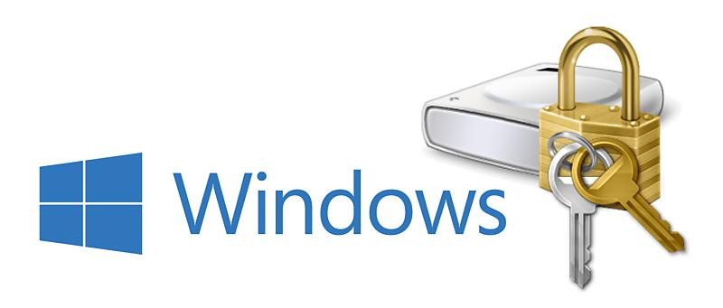

# BitLocker

## BitLocker란?

BitLocker란 Windows OS에 내장된 HDD, USB와 같은 저장 매체를 암호화하여 데이터를 보호하는 기술이다.

전체 디스크를 암호화하는 Full Disk Encrytion(FDE) 기술이라고도 한다.

특정한 폴더나 파일이 아니라 디바이스 전체나 파티션 전체를 암호화하는 것이 특징이다.

## 수행 절차

Windows OS에서 BitLocker를 하려는 장치(파티션)를 오른쪽 마우스를 눌러서 BitLocker 과정을 진행

1. 패스워드 설정
2. 복구 키 저장. Microsoft 계정이나 File에 저장 가능
3. 암호화할 공간 선택
4. BitLocker 암호화 수행

BitLocker가 동작하면 패스워드가 5회 이상 틀리거나, 사용하던 하드웨어가 변경되면 암호 대신에 저장한 복구 키(48자리)를 요구한다.

Windows OS의 BitLocker는 기본적으로 TPM-only 모드라는 윈도우 부팅시 TPM**[1](https://melonicedlatte.com/2020/06/16/113200.html#fn:1)** (Intel PTT, AMD fTPM)이 자동으로 비밀번호를 입력하고, 유저가 비밀번호 입력은 필요 없는 모드로 작동한다고 한다.

## 필요조건

BitLocker를 실행하려면 다음과 같은 조건이 필요하다.

1. 호환 가능한 운영 체제: BitLocker는 Windows 10, Windows 8.1, Windows 8, Windows 7, Windows Server 2019, Windows Server 2016, Windows Server 2012 R2, 및 Windows Server 2012와 호환,
   이러한 운영 체제 버전 중 하나를 실행 중이어야 한다.
2. TPM (Trusted Platform Module): TPM은 컴퓨터의 보안 하드웨어 칩으로, BitLocker의 핵심적인 구성 요소입니다. TPM은 디스크 암호화 키를 안전하게 저장하고 컴퓨터의 부팅 과정에서 무결성을 보장한다. 따라서 BitLocker를 사용하기 위해서는 TPM이 컴퓨터에 내장되어 있거나 별도로 추가되어 있어야 한다. 대부분의 최신 컴퓨터에는 TPM이 내장되어 있다.
3. TPM 호환성 모드: TPM이 활성화되어 있어야 하며, BIOS 또는 UEFI 설정에서 TPM을 활성화해야 다. 이를 위해 컴퓨터 제조사에서 제공하는 BIOS/UEFI 설정을 확인하고, TPM을 활성화해야 한다.
4. TPM PIN 또는 USB 키 사용 여부: BitLocker는 부팅 시에 암호를 요구하거나 USB 키를 사용하여 인증할 수 있습니다. 이러한 추가적인 인증 수단을 설정하려면, 컴퓨터의 BIOS/UEFI 설정에서 해당 옵션을 활성화하고 설정해야 한다.
5. 시스템 드라이브의 용량 및 파일 시스템: BitLocker는 시스템 드라이브(일반적으로 C 드라이브)의 전체 암호화를 지원한다. 시스템 드라이브는 충분한 용량을 갖추고 있어야 하며, NTFS 파일 시스템이여야 한다.
6. 관리자 권한: BitLocker를 사용하려면 관리자 권한을 가진 사용자로 로그인해야 한다. 일반 사용자 계정으로는 BitLocker를 설정하거나 관리할 수 없다.

이러한 조건을 충족한 경우, BitLocker를 사용하여 시스템 드라이브나 다른 저장 장치를 암호화할 수 있다.

> BitLocker는 보안을 강화하여 데이터 유출로부터 시스템을 보호하고, 분실된 컴퓨터의 데이터 접근을 어렵게 한다.
